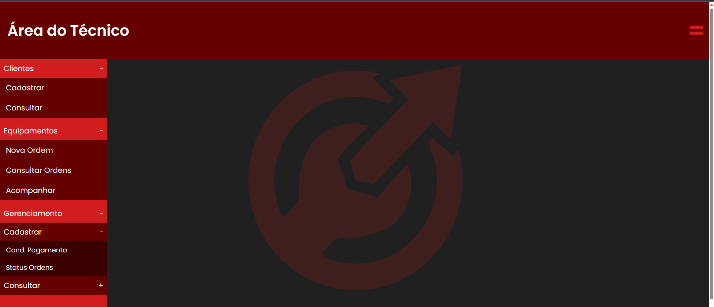

# Frontend: MaintFlow

Repositório e documentação Frontend para a API MaintFlow.

## Documentação da API

A documentação da API pode ser acessada no seguinte repositório: https://github.com/JoaoPedroFavero/MaintFlow

## Tecnologias

- **React** 19.2.7 - Biblioteca JavaScript para construção de interfaces
- **React Router DOM** - Roteamento para SPA (Single Page Application)
- **Axios** - Cliente HTTP para requisições à API
- **Vite** 8.1.1 - Build tool e dev server
- **ESLint** - Linting para JavaScript/React
- **CSS Custom Properties** - Variáveis CSS para gerenciamento de cores

## Instalação

```bash
# Clone o repositório
git clone https://github.com/JoaoPedroFavero/MaintFlow-Frontend.git

# Entre no diretório
cd MaintFlow-Frontend

# Instale as dependências
npm install
```

## Scripts Disponíveis

```bash
# Inicia o servidor de desenvolvimento
npm run dev

# Build para produção
npm run build

# Executa o linting
npm run lint

# Preview do build de produção
npm run preview
```

## Estrutura do Projeto

```
maintflow-system/
├── src/
│   ├── assets/          # Assets estáticos (logos, ícones, imagens)
│   ├── components/      # Componentes reutilizáveis
│   │   └── Layout/      # Layout com sidebar e header
│   ├── pages/           # Páginas da aplicação
│   │   ├── Home/        # Página de login
│   │   ├── Dashboard/   # Dashboard principal
│   │   ├── Cadastrar-clientes/  # Formulário de cadastro de clientes
│   │   └── Consultar-clientes/   # Consulta de clientes
│   ├── services/        # Serviços e conexões com API
│   │   └── connection.js # Configuração do Axios
│   ├── index.css        # Estilos globais
│   └── main.jsx         # Entry point da aplicação
├── index.html           # Template HTML
├── package.json         # Dependências e scripts
├── vite.config.js       # Configuração do Vite
└── eslint.config.js     # Configuração do ESLint
```

### Paleta de Cores

- **Background Dark**: `#202020`
- **Background Medium Red**: `#d11d1d`
- **Background Dark Red**: `#640000`
- **Background Darkest Red**: `#3a0000`
- **Text Gray**: `#595959`
- **Check Green**: `#00bf63`
- **Check Green Dark**: `#00a355`
- **Fonte**: Poppins (sans-serif)

## Funcionalidades

### Sistema de Autenticação

- **Login**: POST `/auth/login` com usuário e senha
- Tratamento de erros específicos (404, 401, 400)
- Validação de campos obrigatórios
- Mensagens de erro amigáveis ao usuário

### Layout Reutilizável

- Componente `Layout` com sidebar e header compartilhados
- Logo no background apenas no Dashboard
- Dropdowns multinível na sidebar (Clientes, Equipamentos, Gerenciamento)
- Navegação via React Router

### Páginas

#### Home
- Formulário de login com validação
- Integração com API de autenticação
- Design responsivo com logo no background

#### Dashboard
- Área do técnico com sidebar de navegação
- Logo no background centralizada
- Dropdowns multinível:
  - **Clientes**: Cadastrar e Consultar
  - **Equipamentos**: Nova Ordem, Consultar Ordens e Acompanhar
  - **Gerenciamento**: Cadastrar e Consultar (com sub-níveis para Condições de Pagamento e Status Ordens)

#### Cadastrar Clientes
- Formulário com campos para CNPJ/CPF, Razão Social, Nome Fantasia, Telefone, Endereço, etc.
- Formatação automática de telefone em tempo real
- Layout responsivo com inputs organizados em linhas
- Botão de cadastro com ícone de confirmação

#### Consultar Clientes
- Página base para consulta de clientes (em desenvolvimento)

## Screenshots

### Home Page


### Dashboard



## 🚧 Em Desenvolvimento

- ✅ Sistema de autenticação integrado com API
- ✅ Layout reutilizável com sidebar e header
- ✅ Página Home com formulário de login
- ✅ Página Dashboard com sidebar de navegação e dropdowns multinível
- ✅ Página Cadastrar Clientes com formulário completo
- 🚧 Página Consultar Clientes
- 🚧 Gestão de ordens de serviço
- 🚧 Relatórios e estatísticas
- 🚧 Integração completa com API para todas as funcionalidades